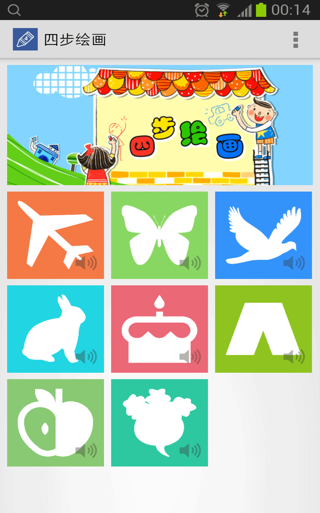
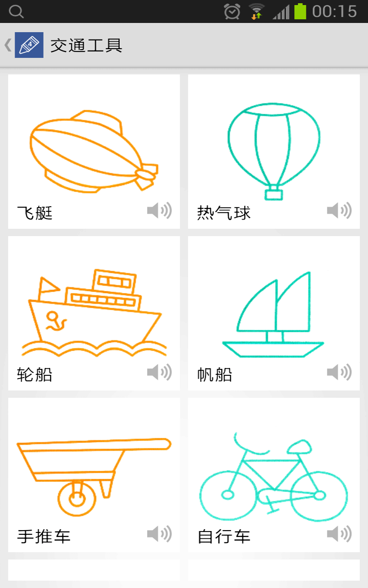
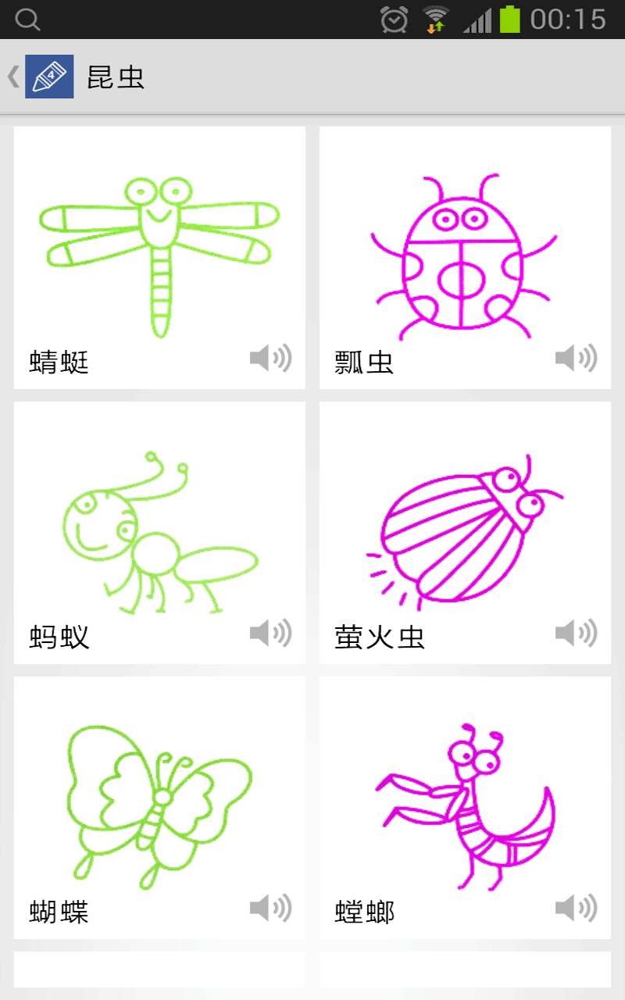
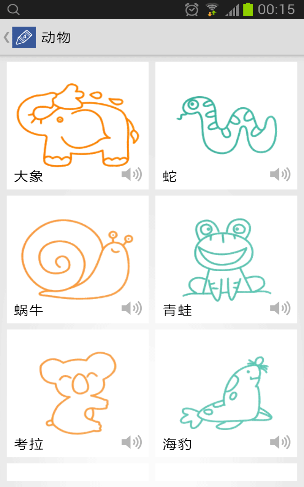
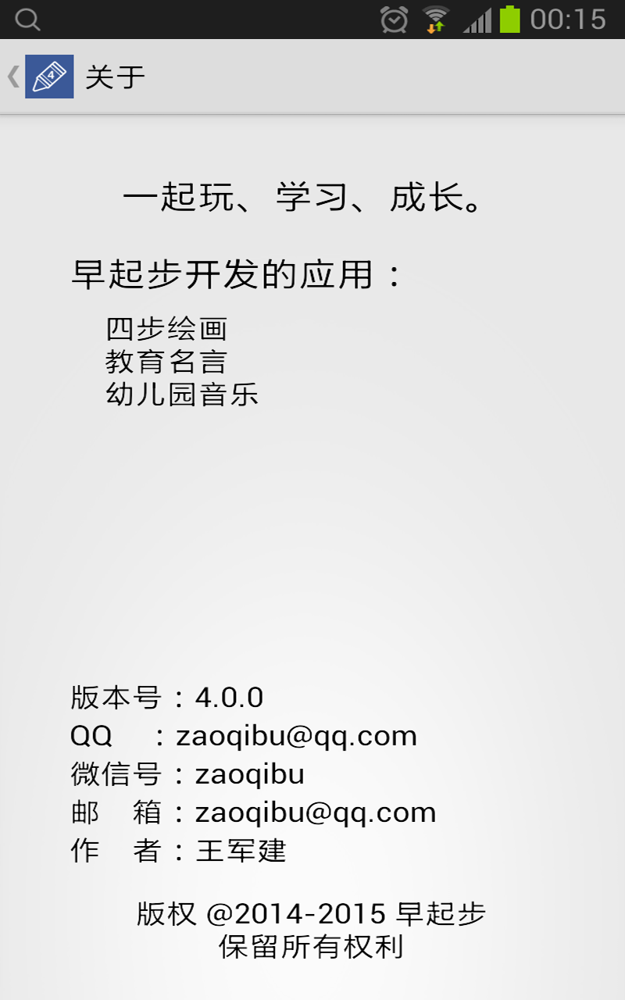

# 四步绘画

## 介绍
四步绘画的主要目标是让宝宝喜欢上绘画，通过本应用自主学习绘画。
本应用提供的绘画，分为交通工具、昆虫、鸟类、动物、食物、服饰、水果、蔬菜等类别。每一幅画分解成四个步骤来完成，每一步都有童谣，通过朗朗上口的童谣让儿童喜欢说，边说边画，一幅画就出来了。画画原来如何简单！
亲爱的爸爸妈妈们，请为你们的宝宝准备好纸和笔，让宝宝启航吧！

## 功能
* 每一幅画分四步来绘制。
* 每一步都配有童谣。
* 通过语音儿童可以自主学习绘画。
* 目前包含了交通工具、昆虫、鸟类、动物、食物、服饰、水果、蔬菜等类别的绘画（多达上百幅绘画）。

## 效果
* 儿童喜欢上画画
* 儿童容易掌握画画
* 儿童可以自主学习
* 儿童可以创造童谣

## 截图

